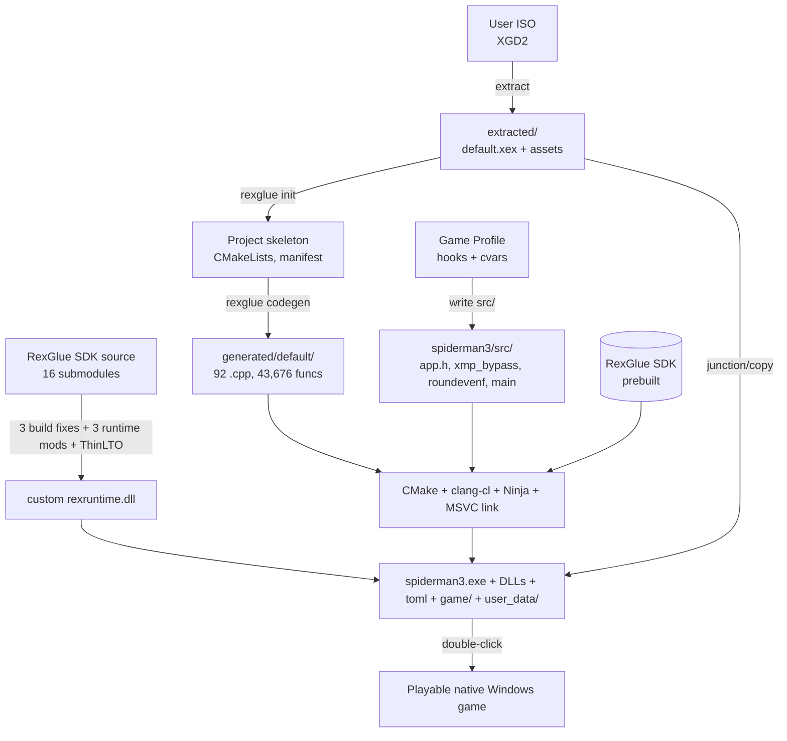

# Spider-Man 3 Recompiler — Application Specification & User Documentation

> **Document status:** Design specification (brainstorm output, 2026-07-07).
> Covers the end-to-end application that automates the manual recompilation
> pipeline demonstrated on Spider-Man 3 (Xbox 360) using the RexGlue360 SDK.
> Intended for both **end users** (who want a playable native Windows port of
> their own legally-owned game) and **developers** (who want to extend the
> tool or add support for other titles).
>
> **Grounding:** Built on the project's existing documentation —
> `README.md`, `STATUS.md`, `DOCS/BUILD_GUIDE.md`, `DOCS/TROUBLESHOOTING.md`,
> `DOCS/LESSONS_LEARNED.md`, `DOCS/RUNTIME_FIXES.md`,
> `DOCS/CVAR_REFERENCE.md`, `DOCS/FUNCTION_IDENTIFICATION.md`,
> `DOCS/FILE_INVENTORY.md`, and `RESEARCH/01-08_*.md`. All technical claims
> below trace back to those sources or to the working `spiderman3.exe`
> artifact at `C:\tmp\Spider-Man 3\`.

---

## Table of Contents

1. [Executive Summary](#1-executive-summary)
2. [System Requirements](#2-system-requirements)
3. [Installation Guide](#3-installation-guide)
4. [Usage Guide](#4-usage-guide)
5. [Troubleshooting](#5-troubleshooting)
6. [Legal & Ethical](#6-legal--ethical)
7. [Technical Architecture](#7-technical-architecture)
8. [Game Profile Specification](#8-game-profile-specification)
9. [FAQ](#9-frequently-asked-questions)
10. [Changelog](#10-changelog)

---

## 1. Executive Summary

### 1.1 What is it?

The **Spider-Man 3 Recompiler** is a Windows application that takes a user's
legally-owned **Spider-Man 3 (Xbox 360, 2007)** disc image (XGD2 ISO) and
produces a **native Windows x64 executable** that runs the game without an
emulator. It automates the entire pipeline that was performed manually over
many sessions on this project:

1. **Extract** the ISO (XDVDFS) → `default.xex` + game assets.
2. **Recompile** the PowerPC XEX into x86-64 C++ using the RexGlue360 SDK
   (`rexglue init` → `rexglue codegen`). For Spider-Man 3 this produces
   43,676 functions across 92 generated `.cpp` files.
3. **Patch** the generated project with the game-specific fixes that make it
   boot and render correctly — 3 system-call hooks (`xmp_bypass.cpp`), the
   **22 cvars** forced in `spiderman3_app.h::OnPreSetup` (ROV render path,
   60 FPS unlock, 4 city-rendering fixes, anisotropic/FXAA, and 14
   SDK-source-informed performance cvars), portable path configuration, a
   CRT math shim (`roundevenf.cpp`), a placeholder particle hook file
   (`particle_perf.cpp`), and a Dynamic Resolution Scaling hook
   (`dynamic_resolution.cpp` — see §4.4 for the build-wiring discrepancy).
4. **Build a custom runtime** (`rexruntime.dll`) from the RexGlue SDK source
   with 3 save-system fixes + ThinLTO + `kQueueFrames=2`. This is the
   load-bearing runtime fix; without it the save system hangs.
5. **Build** the game project (CMake + clang-cl + Ninja + MSVC linker) into a
   118 MB `spiderman3.exe`.
6. **Deploy** a self-contained portable folder: `spiderman3.exe` +
   `rexruntime.dll` + `TracyClient.dll` + `spiderman3.toml` + a `game\`
   junction to the extracted assets + `user_data\` for saves and the shader
   cache.

The output is **not an emulator**. There is no JIT, no interpreter, no
translation tax at runtime — the Xbox 360 game code was lifted to C++ once at
build time and compiled by Clang into a regular Windows executable that talks
to Direct3D 12, XAudio2, and XInput directly. This is the same paradigm as
N64Recomp (which produced *Zelda 64: Recompiled*), applied to a far more
complex 7th-generation console.

### 1.2 Who is it for?

| Audience | What they get |
|---|---|
| **End users (players)** | A one-click path from "I own the Xbox 360 disc" to "I have a native PC port running at 60 FPS with fixed rendering, saves, and FXAA." No reverse-engineering knowledge required. |
| **Modders / tinkerers** | A clean project skeleton with a documented hook system (`REX_HOOK_RAW` link-time overrides, no trampolines) and 18,871 already-identified functions to build on. |
| **Recompilation developers** | A reusable, game-profile-driven pipeline. The Spider-Man 3 profile is the reference; other Xbox 360 titles can be added via a profile file (see §8). |
| **Preservationists / researchers** | A working, auditable example of static recompilation for a 7th-gen title — the code path, the fixes, and the tradeoffs are all documented. |

### 1.3 What does it do?

**Inputs (user-provided):**
- A Spider-Man 3 (Xbox 360) XGD2 ISO, e.g. `Spider-Man 3 (USA, Europe).iso`
  (~7.3 GB). The user must own this — the app does not provide it.

**Inputs (bundled with the app):**
- RexGlue360 SDK v0.8.0 (prebuilt: `rexglue.exe`, `rexruntime.dll`,
  `TracyClient.dll`, headers, static libs) — or the SDK source tree for the
  custom runtime build.
- The Spider-Man 3 game profile: hooks, cvars, manifest hints, build scripts.
- Build toolchain bootstrap: a helper that verifies/installs LLVM, MSVC,
  CMake, Ninja (or points the user at the prerequisites).

**Outputs:**
- A portable folder containing `spiderman3.exe` (118 MB), the custom
  `rexruntime.dll`, `TracyClient.dll`, `spiderman3.toml`, a `game\` link to
  the extracted assets, and a `user_data\` tree (saves + 407-PSO shader
  cache after first launch).
- Double-click `spiderman3.exe` to play. No installer, no command-line args,
  no registry entries. VSync disabled, 60 FPS unlocked, saves local to the
  folder.

### 1.4 Why this and not an emulator?

| | Static recomp (this app) | Xenia (emulator) |
|---|---|---|
| CPU execution | Native x86-64, no JIT | JIT at runtime |
| Per-frame CPU tax | None | Translator overhead |
| Host compiler optimizations | Full LTO/autovectorization over lifted code | N/A |
| Debuggability | Plain C++ in a normal debugger | Interpreter internals |
| Code grep / RE | 43K functions are text-searchable C++ | Raw PPC opcodes |
| Bringup cost per game | High (manual hooks/manifest) | Low (load ISO) |

The tradeoff is **bringup cost**: a recomp requires per-game fix work, which
is exactly what this app automates for Spider-Man 3 and templatises for other
titles via game profiles.

### 1.5 Project status (as of this document)

Grounded in the working artifact at `C:\tmp\Spider-Man 3\` and the actual
project source (`spiderman3/src/*`, `CMakeLists.txt`). Note: `STATUS.md`
and several older docs are stale on hook/cvar counts — see §4.4
"Documentation drift"; this section uses the source-of-truth values.

- ✅ Native Windows x64 executable (118 MB), portable standalone folder.
- ✅ Full 3D rendering via D3D12 + ROV (rasterizer-ordered views).
- ✅ XMA audio decoding; input via DualSense (SDL) + keyboard/mouse.
- ✅ Game playable through the tutorial section.
- ✅ 3 system-call hooks in `xmp_bypass.cpp` (XMP bypass, device state,
  device selector + XN_SYS_UI lifecycle).
- ✅ Save system working (device selector → enumerate saves → new game) via
  3 coordinated runtime patches in a custom `rexruntime.dll`.
- ✅ 60 FPS unlocked (`video_mode_refresh_rate = 120.0`, vblank-wait-for-2).
- ✅ City rendering fixed (4-cvar combo: gamma + snorm16 + MRT clamp +
  fast readback).
- ✅ Anisotropic filtering (`5` — max effective, not 16) + FXAA post-process.
- ✅ **22 cvars forced in `OnPreSetup`** — the 9 correctness/visual cvars
  above plus a 14-cvar SDK-source-informed performance set (bindless, tiled
  shared memory, presentation decoupling, ECL batching, PSO-thread-count
  fix, memexport readback, texture-cache budgets, fuzzy alpha, dither,
  shader persistence).
- ✅ Dynamic Resolution Scaling hook authored
  (`src/dynamic_resolution.cpp`) — **not wired into `CMakeLists.txt`**;
  shipped exe runs at fixed 720p internal. See §4.4 for the discrepancy.
- ✅ Custom `rexruntime.dll` built from SDK source with ThinLTO (5–15% gain)
  and `kQueueFrames=2` (FPS minimums 23→30+, average 46–48).
- ✅ 18,871 / 43,676 functions named (43.21%); 10,085 from RTTI vtables
  alone.
- ✅ Shader cache (407 PSOs) accumulates across runs.
- 🔧 Roadmap: full playthrough stability testing, resolution scaling beyond
  720p, modding framework, HD textures, Vulkan backend (untested).

> **Note on the app vs. the current manual pipeline:** everything in §1.3 is
> today performed by hand via `build.bat`, `rebuild_runtime_lto.bat`, and
> manual file copies. The application described in this document wraps those
> steps into a guided, automated, shareable tool. The underlying commands
> and fixes are identical and are documented in `DOCS/BUILD_GUIDE.md`.

---

## 2. System Requirements

### 2.1 Runtime requirements (to *play* the produced game)

| Component | Minimum | Recommended | Notes |
|---|---|---|---|
| **OS** | Windows 10 64-bit (build 19041+) | Windows 11 | The runtime uses D3D12; Linux via Proton is untested. |
| **CPU** | 4-core x86-64, AVX2 | 6+ cores, modern IPC | The recomp is native code; no JIT. Spider-Man 3 holds 46–48 FPS avg on a Ryzen Z1 Extreme. |
| **RAM** | 8 GB | 16 GB | Game + 512 MB Xenos shared memory + shader cache. |
| **GPU** | D3D12 feature level 11_0 + **ROV support** (rasterizer-ordered views) | D3D12 FL 12_1+, 4 GB+ VRAM | **ROV is mandatory** — `render_target_path_d3d12 = "rov"` is the load-bearing render fix. Pre-DXR / older GPUs without ROV cannot run the game. FreeSync/G-Sync recommended (the config enables VRR + tearing). |
| **Disk** | 25 GB free | 30 GB free | ISO (~7.3 GB) + extracted assets (~13.5 GB) + SDK (~2 GB) + build output (~2 GB) + shader cache (grows, ~hundreds of MB). |
| **Disk type** | SSD | NVMe SSD | First-launch compiles 407 PSOs; an SSD materially shortens the ~20 s warm-up. |
| **Input** | Keyboard + mouse | DualSense controller (auto-detected via SDL) | The game was designed for a controller. |
| **Display** | 1080p60 | 1080p+ @ 120 Hz with VRR | 60 FPS is the target; a 120 Hz VRR display avoids any present tearing at the uncapped rate. |

### 2.2 Build-time requirements (to *recompile* the game)

These are needed only when producing a fresh `spiderman3.exe` from the ISO.
The verified toolchain (from `DOCS/BUILD_GUIDE.md`):

| Tool | Verified version | Install path / source | Purpose |
|---|---|---|---|
| **LLVM / clang-cl** | **22.1.8** | `C:\Program Files\LLVM\bin\` | The compiler. clang-cl emits C++23 that uses `__builtin_rintf` and other clang-specific intrinsics to model PPC instructions. |
| **MSVC (Visual Studio 2022 Community)** | **14.44.35207** | `C:\Program Files\Microsoft Visual Studio\2022\Community\VC\` | Provides `link.exe`, the Windows SDK headers, and the CRT libs. clang-cl reuses the MSVC toolchain for linking. The "Desktop development with C++" workload is required. |
| **CMake** | **4.2.1** | on `PATH` | Build configuration. |
| **Ninja** | **1.13.2** | on `PATH` | Build executor; parallelizes the 92 generated shards. |
| **RexGlue360 SDK** | **v0.8.0** | bundled with the app | The recompiler (`rexglue.exe`) + prebuilt runtime (`rexruntime.dll`) + headers + static libs. |
| **RexGlue SDK source** | **v0.8.0** (16 git submodules) | optional, for custom runtime build | Required only to build the patched `rexruntime.dll` (save-system fixes + ThinLTO). Ships with the app or fetched on demand. |

**Disk for build:** ~30 GB free (toolchain + SDK + source tree + extracted
game + build output + a 496 MB Tracy trace if profiling is enabled — that
trace is a cleanup candidate).

**Why clang-cl + MSVC together?** clang-cl on Windows does not ship its own
linker or Windows SDK — it reuses the MSVC toolchain. `vcvarsall.bat x64`
must be run first to set up `INCLUDE`/`LIB`/`PATH`, then `clang-cl` is put on
`PATH` as the compiler. This is why the app's build helper must locate or
install both.

### 2.3 Known incompatibilities

- **PGO is not viable.** clang's PGO runtime (`-fprofile-instr-generate`) is
  incompatible with `lld-link` on Windows for this project's link
  configuration. ThinLTO is shipped instead (5–15% gain). See
  `DOCS/LESSONS_LEARNED.md` §8.1.
- **PGO + ThinLTO are mutually exclusive** in clang — you pick one. The app
  uses ThinLTO.
- **Vulkan backend exists but is untested** for Spider-Man 3. All rendering
  fixes are D3D12-backend cvars; switching to Vulkan would require
  re-deriving the cvar set and rebuilding the 407-PSO shader cache from
  scratch. Future work only.
- **MSVC-only build path was abandoned.** The project requires clang-cl
  (vanilla `cl.exe` cannot compile the codegen output). An abandoned
  `msvc-release/` build dir exists as a historical artifact.

---

## 3. Installation Guide

### 3.1 Get the app

The app is distributed via GitHub (recommended) or as a zip on a file-sharing
host. **It does not contain any copyrighted game assets** — no ISO, no
`default.xex`, no textures, no audio. It contains only:

- The app binary (`spiderman3-recompiler.exe`) and its UI/runtime.
- The RexGlue360 SDK (prebuilt, or a fetcher that downloads it on first run
  subject to the RexGlue license — see §6).
- The Spider-Man 3 game profile (hooks, cvars, manifest, build scripts).
- This documentation.

> **Distribution shape (design proposal):** a single `SpiderMan3Recompiler/`
> folder containing the app, the SDK, the profile, and a `games/` directory
> where per-game outputs land. The app is portable — no installer required.
> A GitHub Releases page would host versioned zip packages; the source repo
> would let developers build the app itself.

### 3.2 Install build dependencies

On first run, the app checks for the build toolchain and either auto-installs
or guides the user through:

1. **Visual Studio 2022 Community** with the "Desktop development with C++"
   workload. The app verifies `vcvarsall.bat` exists at the expected path.
2. **LLVM 22.x+** at `C:\Program Files\LLVM\`. The app verifies
   `clang-cl --version` reports an MSVC-target build.
3. **CMake 4.x** and **Ninja 1.13+** on `PATH`.

The app surfaces a single "Prerequisites" panel showing green/red per item,
with one-click links to each installer. A "Build environment test" button
runs `vcvarsall.bat x64` + `clang-cl --version` + `cmake --version` +
`ninja --version` and reports any failures.

### 3.3 First-run setup

1. Launch the app.
2. Point it at your **Spider-Man 3 ISO** (the app computes a SHA-256 of the
   ISO and warns if it does not match the known USA/Europe retail hash; a
   mismatch does not block the run but flags that fixes may not apply
   cleanly).
3. Choose an output folder (default: `<app_dir>\games\spiderman3\`).
4. Click **Recompile & Build**. The app runs the full pipeline (§4) and
   reports progress per stage. Expect ~20–40 minutes on the recommended
   hardware, dominated by codegen + the 92-shard compile + the custom
   runtime ThinLTO link.
5. When complete, the app opens the output folder containing
   `spiderman3.exe`. **Double-click to play.**

> First launch of the produced *game* (not the app) compiles 407 shader
> pipelines synchronously and shows a ~20 s "Not Responding" window — this
> is normal (§5.7). Subsequent launches load the warm cache in ~1–2 s.

### 3.4 Optional: custom runtime build

By default the app uses a **prebuilt custom `rexruntime.dll`** that the
project ships (with the 3 save-system patches + ThinLTO + `kQueueFrames=2`
already applied). Users who want to rebuild the runtime from the RexGlue SDK
source can enable "Custom runtime build" in the app, which:

1. Fetches the RexGlue SDK source tree (16 git submodules) if not present.
2. Applies the 3 source-tree build fixes (xxHash CMake path, libmspack
   symlinks, CMake 4.x module scan bug — see `DOCS/BUILD_GUIDE.md` §7b).
3. Applies the 3 runtime source modifications (`xam_ui.cpp`,
   `xam_enum.cpp`, `xenumerator.cpp`, `render_target_cache.cpp`,
   `command_processor.h`).
4. Runs `rebuild_runtime_lto.bat` (ThinLTO + Release).
5. Drops the resulting `rexruntime.dll` into the output folder.

This is an advanced path; most users should accept the prebuilt custom DLL.

---

## 4. Usage Guide

The end-to-end pipeline, as the app automates it. Each step maps to the
manual commands documented in `DOCS/BUILD_GUIDE.md`.

### 4.1 Provide the ISO

- **User action:** select the Spider-Man 3 XGD2 ISO.
- **App action:** verify the ISO is an XDVDFS image, locate the game
  partition (the one containing `default.xex`, not `$SystemUpdate`), and
  present the extraction plan.

### 4.2 Extract the ISO

- **App action:** parse the XDVDFS volume descriptor and extract the game
  partition to `<output>\extracted\`:
  ```
  extracted\
  ├── default.xex          (14 MB — the Xbox 360 executable, recompilation input)
  ├── amalga.toc           (asset table of contents)
  ├── movies\              (.wmv/.wma cutscenes)
  ├── packs\               (1,228 .XEPACK asset packs)
  ├── sound\               (.xessb sound banks + en/ voice packs)
  └── $SystemUpdate\       (Xbox 360 firmware — ignored)
  ```
- **Verification:** `extracted\default.xex` must exist. The app aborts with
  a clear error if not.

### 4.3 Recompile (RexGlue init + codegen)

- **App action:**
  1. `rexglue init --name spiderman3 --xex extracted\default.xex` — creates
     the project skeleton (`CMakeLists.txt`, `CMakePresets.json`,
     `spiderman3_manifest.toml`, `generated/rexglue.cmake`).
  2. Injects the Spider-Man 3 **manifest entrypoint hints** (9 PowerPC
     addresses that codegen treats as analysis roots — see
     `DOCS/BUILD_GUIDE.md` Step 3).
  3. `rexglue codegen spiderman3_manifest.toml` — disassembles the XEX's
     PowerPC code, translates each function to C++, and emits the generated
     source files.
- **Output:** 43,676 functions across 92 generated `spiderman3_recomp.NN.cpp`
  files (0–91) plus `spiderman3_init.cpp` and `spiderman3_register.cpp`,
  in `generated/default/`.
- **Critical rule:** the app never edits files in `generated/` by hand —
  they are codegen output and would be wiped on a recomp. All game-specific
  behavior goes in `src/` via the profile's hooks and cvars.

### 4.4 Patch (apply the game profile)

The app writes the Spider-Man 3 profile's hand-written source files into
`spiderman3/src/`. **All counts and cvar values below are grounded in the
actual source files** (`spiderman3/src/*`, `CMakeLists.txt`), which differ
in several places from the older `README.md` / `RUNTIME_FIXES.md` / `STATUS.md`
(see "Documentation drift" note at the end of this section).

| File | In `CMakeLists.txt`? | Role |
|---|---|---|
| `src/main.cpp` | yes | App entry point: `REX_DEFINE_APP(spiderman3, Spiderman3App::Create)`. |
| `src/spiderman3_app.h` | (header) | **The critical configuration file.** Defines `Spiderman3App` with three lifecycle hooks: `OnConfigurePaths` (portable exe-relative paths), `OnPreSetup` (the **22** forced cvars), `OnPostLoadXexImage` (data-section dump for RE). |
| `src/xmp_bypass.cpp` | yes | The **3** `REX_HOOK_RAW` system-call hooks (XMP bypass, device state, device selector + XN_SYS_UI lifecycle). |
| `src/roundevenf.cpp` | yes | CRT math shim — MSVC's CRT does not provide `roundevenf`, which clang-cl emits for PPC rounding instructions (`frin`/`frip`/`frim`/`friz`). Without it the link fails with an unresolved external. |
| `src/particle_perf.cpp` | yes | **Placeholder** — a particle-count hook was attempted (`particle_generator_vfunc8`) but found not to be a particle-count getter (returning 150 instead of 300 crashed; returning 300 was safe). Kept in `CMakeLists.txt` for future hook additions; currently has no active hooks. |
| `src/dynamic_resolution.cpp` | **no** ⚠️ | **Dynamic Resolution Scaling (DRS) hook** — a real, working hook on `FrameDelta_Compute` (`sub_8284E6B8`) that chain-throughs to `__imp__FrameDelta_Compute` and adaptively scales `draw_resolution_scale_x/y` between 1 and 3 to hold 60 FPS, pairing with `present_effect = "cas"` to sharpen. **This file builds a `.obj` but is NOT listed in `CMakeLists.txt`'s `SPIDERMAN3_SOURCES` — a real discrepancy.** The shipped `spiderman3.exe` therefore does NOT include DRS. See the discrepancy note below. |

The app also wires `CMakeLists.txt` (C++23, `WIN32` executable,
`rexglue_setup_target`, `/EHa` for SEH with structured exceptions). The
real `CMakeLists.txt` lists **4** sources (`main.cpp`, `roundevenf.cpp`,
`xmp_bypass.cpp`, `particle_perf.cpp`) — note this differs from the
3-source snippet in `DOCS/BUILD_GUIDE.md` Step 4, which omits
`particle_perf.cpp`.

**The 3 hooks in `xmp_bypass.cpp`:**

| # | Hook | Returns | Purpose |
|---|---|---|---|
| 1 | `XMPGetStatus_Wrapper` | `r3=0` (kIdle) | Skip Bink/WMV video polling; game thinks playback is done. |
| 2 | `XamContentGetDeviceState_Wrapper` | `r3=0` (success) | Storage device always reports ready. |
| 3 | `XamShowDeviceSelectorUI_Wrapper` | sync SUCCESS + `device_id=1` + `XN_SYS_UI` true→false (200 ms delayed false) | **THE key save-system fix.** Reproduces the full device-selector + notification lifecycle for the game's late-created listener (`F8000090`). |

**The forced cvars in `spiderman3_app.h::OnPreSetup`** — **22 cvars total**,
forced after TOML load so they survive user edits. They split into five
functional groups (matching the source comments in `spiderman3_app.h`):

*Render path (1):*

| Cvar | Value | Why |
|---|---|---|
| `render_target_path_d3d12` | `"rov"` | EDRAM emulation; menus/UI render correctly. **Single most important cvar.** |

*60 FPS unlock (1):*

| Cvar | Value | Why |
|---|---|---|
| `video_mode_refresh_rate` | `120.0` | 60 FPS unlock (guest vsync-wait-for-2 → 60 Hz). |

*City rendering fixes (4) — must be applied together:*

| Cvar | Value | Why |
|---|---|---|
| `gamma_render_target_as_unorm16` | `true` | City white/bloom fix (1 of 4). |
| `snorm16_render_target_full_range` | `true` | City white/bloom fix (2 of 4). |
| `mrt_edram_used_range_clamp_to_min` | `true` | City white/bloom fix (3 of 4). |
| `readback_resolve` | `"fast"` | City white/bloom fix (4 of 4). `some` was tested and reverted (visual artifacts). |

*Visual enhancements (2):*

| Cvar | Value | Why |
|---|---|---|
| `anisotropic_override` | `5` | Crisp ground/street textures. **Max effective is 5, not 16** — the engine clamps above 5. |
| `swap_post_effect` | `"fxaa"` | CP-level FXAA on the front-buffer resolve. (`native_2x_msaa` is **not** set, despite some older docs claiming otherwise.) |

*Performance optimizations (14) — SDK-source-informed:*

| Cvar | Value | Why |
|---|---|---|
| `d3d12_pipeline_creation_threads` | `"2"` | Avoids the ~10× PSO-build slowdown from driver-lock + `shader_translator_` mutex contention at the auto (`-1`) thread count. |
| `host_present_from_non_ui_thread` | `true` | Decouple guest frame production from the OS paint event — biggest latency win for refresh-rate mismatches. |
| `d3d12_bindless` | `true` | Bindless descriptor heaps. |
| `d3d12_tiled_shared_memory` | `true` | Tiled resource for the 512 MB shared memory. |
| `d3d12_submit_on_primary_buffer_end` | `false` | Batch ECLs — each `ExecuteCommandLists` triggers a full UAV barrier on the EDRAM buffer; batching reduces barrier count. |
| `readback_memexport` | `true` | EDRAM memexport readback path (disjoint from `readback_resolve`). |
| `readback_memexport_fast` | `true` | Faster memexport readback. |
| `texture_cache_memory_limit_hard` | `4096` | Hard eviction budget (MB). Default `0`=unlimited causes mid-frame paging on APU shared memory. |
| `texture_cache_memory_limit_soft` | `2048` | Soft eviction budget (MB). |
| `texture_cache_memory_limit_soft_lifetime` | `120` | Lifetime window for soft-evicted textures. |
| `texture_cache_memory_limit_render_to_texture` | `256` | RT texture cache budget (MB). |
| `use_fuzzy_alpha_epsilon` | `true` | Fuzzy alpha-test epsilon. |
| `present_dither` | `true` | Ordered dither on 8 bpc output. |
| `store_shaders` | `true` | Persist all encountered PSOs to `.xpso` so future launches have zero shader stutter. Accumulates while playing. |

> **Note:** `direct_host_resolve` was removed — it is a no-op on the ROV path
> (only works on `kHostRenderTargets`). The 22 above are the complete,
> verified `OnPreSetup` set as of `spiderman3_app.h`.

#### Documentation drift (source vs. older docs)

The counts above are grounded in the actual source. Several older project
docs are stale and contradict the code; the app and this spec treat
`spiderman3/src/*` and `CMakeLists.txt` as the source of truth:

| Claim in older docs | Actual source value |
|---|---|
| README / STATUS: "5 system-call hooks" | **3 hooks** in `xmp_bypass.cpp` (the fake-handle enumerator hooks were removed; the save fix is now 3 hooks + 3 `rexruntime.dll` patches). |
| RUNTIME_FIXES: "the 9 cvars that make it work" | **22 cvars** in `OnPreSetup` (the 13 perf cvars were added later, SDK-source-informed). |
| README: `anisotropic_override = 16` | **`5`** (max effective is 5; engine clamps above). |
| README: `native_2x_msaa = true` | **Not set** in `OnPreSetup`. |
| BUILD_GUIDE Step 4 `CMakeLists.txt`: 3 sources | **4 sources** (adds `particle_perf.cpp`). |
| (undocumented) `src/particle_perf.cpp` | Placeholder file, **in** `CMakeLists.txt`, no active hooks. |
| (undocumented) `src/dynamic_resolution.cpp` | Real DRS hook (see below), **not in** `CMakeLists.txt`. |

#### The `dynamic_resolution.cpp` discrepancy (DRS not shipped)

`src/dynamic_resolution.cpp` is a **real, working Dynamic Resolution
Scaling hook** that is *not* wired into the shipped build:

- **What it does:** hooks `FrameDelta_Compute` (the recomp function at
  `sub_8284E6B8`), chain-throughs to `__imp__FrameDelta_Compute` so the
  game's sim delta is computed normally, then measures wall-clock frame
  time over a 30-frame sliding window and adaptively adjusts
  `draw_resolution_scale_x` / `draw_resolution_scale_y` between **1 and 3**
  to hold 60 FPS. When upscaling it pairs with
  `present_effect = "cas"` (+ `present_cas_additional_sharpness = "0.3"`)
  to sharpen the downsampled image; at scale 1 it falls back to
  `present_effect = "bilinear"`. Includes a busy-wait guard (high avg +
  low stddev → loading screen, skip), a 120-frame startup grace period,
  and a 30-frame cooldown between scale changes.
- **The discrepancy:** the file builds a `.obj` but is **NOT listed in
  `CMakeLists.txt`'s `SPIDERMAN3_SOURCES`**. The shipped `spiderman3.exe`
  therefore does **not** include DRS — it runs at a fixed
  `draw_resolution_scale = 1` (720p internal). This is a real bug in the
  project's build wiring, not an intentional omission.
- **Impact on the perf story:** DRS is directly relevant to the 60 FPS
  theme — it is the mechanism that would let the renderer trade resolution
  for frame-rate stability under load. Without it, the 60 FPS unlock
  (§5.5) relies purely on the vblank-rate cvar and the `kQueueFrames=2` /
  ThinLTO runtime wins. Enabling DRS (adding `src/dynamic_resolution.cpp`
  to `SPIDERMAN3_SOURCES`) is a candidate enhancement; it should be tested
  for interaction with the ROV path (3× scale = 9× the per-pixel UAV
  writes) before shipping.

### 4.5 Build the custom runtime (rexruntime.dll)

If the prebuilt custom DLL is used (default), this step is a no-op. If the
user opted into a from-source runtime build, the app:

1. Locates the RexGlue SDK source tree (16 git submodules).
2. Applies the 3 source-tree build fixes (xxHash CMake path, libmspack
   symlinks, CMake 4.x module scan bug).
3. Applies the 3 runtime source modifications:
   - `xam_ui.cpp`: `xeXamDispatchHeadless` — deferred path with
     `XN_SYS_UI=true/false` pre/post callbacks.
   - `xam_enum.cpp`: `xeXamEnumerate` async path returns
     `X_ERROR_IO_PENDING` (not SUCCESS) — the game's async state machine
     only enters its poll loop after receiving IO_PENDING.
   - `xenumerator.cpp`: `WriteItems` returns `X_ERROR_SUCCESS` for 0 items
     (not `ERROR_NO_MORE_FILES`) — the game treats NO_MORE_FILES as fatal;
     SUCCESS with 0 items means "no saves, create new."
   - `render_target_cache.cpp`: EDRAM barrier skip (skip
     `MarkEdramBufferModified` when a draw writes neither color nor
     depth/stencil). Safe; no measurable gain on SM3 but kept as a
     no-cost correctness change.
   - `command_processor.h`: `kQueueFrames = 2` (was 3) — raises FPS
     minimums from ~23 to 30+, average 46–48.
   - System `CMakeLists.txt`: ThinLTO via
     `INTERPROCEDURAL_OPTIMIZATION_RELEASE TRUE`.
4. Runs `rebuild_runtime_lto.bat` (CMake reconfigure with
   `-DCMAKE_INTERPROCEDURAL_OPTIMIZATION=ON` + build).
5. Copies the resulting `rexruntime.dll` into the output folder.

> **The 3 save-system changes are coordinated — none works alone.** The hook
> reproduces the notification lifecycle; the runtime patches fix the async
> return codes and the empty-enumeration semantics. Fixing one layer is not
> enough; each layer's bug masks the next. See `DOCS/LESSONS_LEARNED.md` §7.6.

### 4.6 Build the game

- **App action:** runs `build.bat`:
  1. `vcvarsall.bat x64` (MSVC environment).
  2. `clang-cl` on `PATH`.
  3. CMake configure: `-G Ninja -DCMAKE_BUILD_TYPE=Release
     -DCMAKE_PREFIX_PATH=<SDK> -DCMAKE_CXX_COMPILER=clang-cl`.
  4. `cmake --build --parallel` — compiles 92 generated shards + 4 project
     sources, links with `rexruntime.lib` + SDK static deps (SDL3, fmt,
     spdlog, snappy, xxhash, libavcodec, libavutil, disasm, o1heap, mspack,
     aes128, …) via MSVC `link.exe`.
- **Output:** `<build_dir>\spiderman3.exe` (118 MB, Windows GUI executable).

### 4.7 Deploy the portable folder

The app assembles the final self-contained folder:

```
<output>\Spider-Man 3\
├── spiderman3.exe          (118 MB — the game)
├── rexruntime.dll          (12.5 MB — custom runtime with save fixes + ThinLTO)
├── TracyClient.dll         (247 KB — profiling client, ships alongside)
├── spiderman3.toml         (runtime config — see §4.8)
├── game\                   (junction to extracted\, or a copy)
│   ├── default.xex
│   ├── amalga.toc
│   ├── packs\, sound\, movies\
│   └── ...
└── user_data\              (created on first launch)
    ├── cache\shaders\      (407-PSO ROV pipeline cache — CRITICAL, do not delete)
    └── ...                 (saves, profile)
```

`OnConfigurePaths` in `spiderman3_app.h` makes the exe fully portable:
- `game_data_root` = `exe_dir\game\` if `default.xex` exists there, else a
  fallback (the dev path in the reference build; the app replaces this with
  the portable layout).
- `user_data_root` = `exe_dir\user_data\` (always — TOML cannot redirect
  this; see §5.10).
- `cache_root` = `exe_dir\user_data\cache\` (always).

### 4.8 Generate the TOML config

The app writes `spiderman3.toml` next to the exe:

```toml
# Spider-Man 3 Recompiled - Runtime Configuration

[GPU]
render_target_path_d3d12 = "rov"                  # required for menu/UI
async_shader_compilation = true                   # reduces first-encounter stutter
vsync = false                                     # uncapped frame rate (60 FPS cap is guest-side)
d3d12_allow_variable_refresh_rate_and_tearing = true
video_mode_refresh_rate = "120.0"                 # 60 FPS unlock (overridden again by OnPreSetup)

[Paths]
game_data_root = "..."                           # only consulted if OnConfigurePaths left it empty
```

> The TOML provides defaults; `OnPreSetup` provides the proven working
> values and runs *after* TOML load, so its values win where they overlap
> (notably `video_mode_refresh_rate`). The 4 city-rendering cvars,
> `anisotropic_override`, and `swap_post_effect` are intentionally **not**
> in the TOML — they are correctness-critical and should not be
> user-editable via the config file.

### 4.9 Play

Double-click `spiderman3.exe`. No command-line args, no installer.

- First launch: ~20 s "Not Responding" window while 407 PSOs compile (§5.7).
  Subsequent launches: ~1–2 s from the warm cache.
- A DualSense controller is auto-detected via SDL; keyboard/mouse also work.
- Saves land in `user_data\` next to the exe.
- **Always exit cleanly** (window close / Alt+F4 / in-game quit). Never
  `taskkill /F` — a force-kill during a shader-cache write corrupts the
  `.xpso` file (§5.6).

---

## 5. Troubleshooting

The full symptom→cause→fix catalog lives in `DOCS/TROUBLESHOOTING.md`.
This section is the user-facing subset, ordered by frequency.

### 5.1 Black menu / UI does not render

- **Symptom:** the 3D city renders but menus/HUD are invisible or garbage.
- **Cause:** the D3D12 render-target path is `rtv` instead of `rov`. The
  Xenos EDRAM tile-based resolve semantics are not emulated correctly by
  `rtv`, so UI resolves come back empty.
- **Fix:** ensure `render_target_path_d3d12 = "rov"` in both the TOML and
  `spiderman3_app.h::OnPreSetup`. The shipped profile forces it; if you see
  the symptom, verify both layers.

### 5.2 Game freezes on start (logo / loading hang)

- **Symptom:** the window appears, the first logo/loading screen shows, then
  the game hangs with CPU near-idle.
- **Cause:** the game polls `XMPGetStatus` waiting for video playback to
  reach `kIdle`; the runtime's HLE doesn't advance the status for
  non-playing intro videos.
- **Fix:** verify the `XMPGetStatus_Wrapper` hook is present and compiled
  into the target (it should always write `0` to the status pointer and
  return `0`).

### 5.3 Storage device selection loop / "Invalid UTF-8" crash

- **Symptom:** the game pops a "select storage device" dialog (or tries to
  enumerate content), then loops forever or crashes with "Invalid UTF-8".
- **Cause:** three cooperating problems: the device selector UI lifecycle,
  the runtime's async return code, and the empty-enumeration semantics.
- **Fix (all three are required, none works alone):**
  1. `XamShowDeviceSelectorUI_Wrapper` returns sync SUCCESS + `device_id=1`
     + `XN_SYS_UI` true→false (200 ms delayed false).
  2. The custom `rexruntime.dll` has `xeXamEnumerate` returning
     `X_ERROR_IO_PENDING` for the async path.
  3. The custom `rexruntime.dll` has `WriteItems` returning
     `X_ERROR_SUCCESS` for 0 items.
- **Do NOT** re-add the old fake-handle enumerator hooks (`0xDEAD0001/0002`)
  — they mask the real runtime bug. And ensure no `Content/` directory was
  created under `user_data` (delete it if one appeared from an unpatched
  run).

### 5.4 City renders white / over-blooming

- **Symptom:** the city skyline/streets/sky render blown-out white with
  extreme bloom and no mid-tones.
- **Cause:** the Xenos EDRAM stores render targets in gamma and snorm16
  formats with a specific used-range; the default D3D12 host path
  misinterprets them.
- **Fix:** all 4 cvars must be applied **together** in `OnPreSetup`:
  `gamma_render_target_as_unorm16=true`,
  `snorm16_render_target_full_range=true`,
  `mrt_edram_used_range_clamp_to_min=true`, `readback_resolve="fast"`.
  Setting only one or two does nothing or makes it worse.

### 5.5 30 FPS lock (game runs at 30, not 60)

- **Symptom:** the game is locked at 30 FPS even with `vsync = false` on a
  high-refresh monitor.
- **Cause:** the game's frame loop waits for 2 vblanks per frame. At
  `video_mode_refresh_rate = 60.0` that's 30 FPS; at `120.0` it's 60 FPS.
- **Fix:** set `video_mode_refresh_rate = "120.0"` (the profile forces it).
  Pair with `vsync = false` and
  `d3d12_allow_variable_refresh_rate_and_tearing = true` so the host
  doesn't re-cap. **Do not push to 240.0 for 120 FPS** — the web-swing
  physics integrator was tuned for 30 Hz and may destabilize.

### 5.6 Game crashes on launch

- **Symptom:** the exe starts, the window may flash, then the process exits
  with a crash (or a D3D12 device-removed error) before the menu.
- **Cause:** the ROV pipeline cache (`.xpso`) is corrupted — usually from
  an interrupted write (force-kill, disk full, GPU driver crash mid-compile).
- **Fix:** delete `user_data\cache\shaders\shareable\*.xpso` (keep the
  `.xsh` files) and relaunch. The next launch recompiles all 407 pipelines
  (expect the §5.7 warm-up). **Do not delete the entire `cache\shaders\`
  directory as a habit** — only the `.xpso` files when you actually see a
  launch crash. Also confirm your GPU supports ROV; pre-DXR/older GPUs may
  not expose it at all.

### 5.7 "Not Responding" on launch (~20 s)

- **Symptom:** double-click the exe; the window appears but Windows marks
  it "Not Responding" for ~20 seconds, then it recovers.
- **Cause:** **normal** on first launch or after deleting the shader cache.
  The 407 D3D12 PSOs compile synchronously on the main thread, starving the
  message pump.
- **Fix:** wait it out. Once the `.xpso` cache is written, subsequent
  launches are responsive in ~1–2 s. If the freeze lasts minutes, suspect
  §5.2 (XMP hang) or §5.6 (device-removed). Keep
  `async_shader_compilation = true` so later-discovered pipelines build on
  background threads.

### 5.8 Permission denied / file in use on build

- **Symptom:** the build fails with "cannot open file … spiderman3.exe" /
  "Permission denied."
- **Cause:** the `spiderman3.exe` you are relinking is currently running.
- **Fix:** close the running game first (Alt+F4 or Task Manager), then
  rebuild. Do **not** `taskkill /F` casually — it can corrupt the shader
  cache (§5.6).

### 5.9 Anisotropic override seems capped at 5

- **Symptom:** setting `anisotropic_override = 16` looks identical to `5`.
- **Cause:** the effective maximum for Spider-Man 3 is 5, not 16. The
  game's samplers and the host GPU's max-aniso converge on 5 as the highest
  level that changes the sampled result; values above 5 are accepted but
  produce no further visual difference.
- **Fix:** use `5`. Don't waste GPU bandwidth on 16.

### 5.10 TOML `user_data_root` / `cache_path` ignored

- **Symptom:** you set these in `spiderman3.toml` but the runtime still
  writes to `<exe_dir>\user_data\`.
- **Cause:** load order. `OnConfigurePaths` runs *before* the TOML is parsed
  by the cvar system and writes directly into the `PathConfig` struct
  (unconditionally overwriting `user_data_root` and `cache_root`). This is
  **intentional for portability** — the standalone folder is self-contained
  and can be moved as a unit.
- **Fix:** if you genuinely need to relocate user data, edit
  `OnConfigurePaths` in `spiderman3_app.h` (read the cvar there before
  assigning). `game_data_root` *is* respected from the TOML when
  `OnConfigurePaths` left it empty.

### 5.11 Missing dependencies (build-time)

- **`vcvarsall failed`** → install VS 2022 with the "Desktop development
  with C++" workload.
- **`clang-cl not found`** → install LLVM 22.x at `C:\Program Files\LLVM\`.
- **`CMake Error: ReXGlue SDK not found`** → ensure
  `-DCMAKE_PREFIX_PATH` points at the SDK root (must contain
  `share\rexglue\`).
- **`unresolved external symbol roundevenf`** → `src/roundevenf.cpp` is
  missing from the build or not listed in `SPIDERMAN3_SOURCES`.
- **`unresolved external symbol __imp__XamEnumerate`** → expected; the hooks
  in `xmp_bypass.cpp` provide the chain-through. Ensure it is in the build.
- **`fatal error C1060: compiler out of heap space`** → build with Ninja
  (`-G Ninja`) so shards parallelize; close other apps.

### 5.12 Tracy profiler won't connect

- **Cause:** the Tracy protocol is not stable across versions. The SDK
  ships the client DLL at **Tracy 0.13.1** but not the profiler UI.
- **Fix:** build the profiler UI from the SDK source tree's
  `thirdparty/tracy/profiler/` (same 0.13.1 source) and connect to
  `localhost`. Do not mix a profiler UI from a different Tracy release.

### 5.13 Quick triage table

| Symptom | First check | Section |
|---|---|---|
| Black menu / no UI | `render_target_path_d3d12 = "rov"` | §5.1 |
| Hang on logo | `XMPGetStatus_Wrapper` hook present | §5.2 |
| Storage loop / UTF-8 crash | device-selector hook + custom runtime patches | §5.3 |
| White / blooming city | all 4 city cvars in `OnPreSetup` | §5.4 |
| 30 FPS | `video_mode_refresh_rate = 120.0` | §5.5 |
| Crash on launch | delete `*.xpso` shader cache | §5.6 |
| Not Responding ~20 s | normal (pipeline compile); wait | §5.7 |
| Permission denied build | close running `spiderman3.exe` | §5.8 |
| Aniso same at 16 | use `5` | §5.9 |
| TOML paths ignored | edit `OnConfigurePaths`, not TOML | §5.10 |
| Tracy won't connect | profiler UI from same 0.13.1 source | §5.12 |

---

## 6. Legal & Ethical

### 6.1 You must own the game

This project is a non-commercial, fan-made technical exercise in static
recompilation. It is **not affiliated with, endorsed by, or sponsored by**
Activision, Treyarch, Marvel, or any rights holder.

- **Spider-Man 3** and all associated trademarks, characters, and assets are
  the property of their respective owners.
- The app **does not include or distribute any copyrighted game assets** —
  no ISO, no `default.xex`, no textures, no audio, no models. It contains
  only the recompilation *toolchain*, the game-specific *patches* (which
  modify recompiled code, not the original binary), and the HLE runtime
  glue.
- To use the app, you must **provide your own legally-obtained copy** of
  Spider-Man 3 for Xbox 360 (e.g. from a retail disc you own) and extract
  the game data into the `game\` subfolder next to the produced exe.
- The purpose is research, preservation, and education in console-game
  recompilation techniques. It is **not a substitute for owning the
  original game**.

### 6.2 No ISOs are distributed

The app's GitHub release and any file-sharing distribution contain
**zero copyrighted game content**. The ISO is the user's input, not the
app's output. The app computes a hash of the provided ISO and warns on
mismatch, but it does not fetch, mirror, or transmit game data.

### 6.3 Patches modify recompiled code, not the original binary

The 3 hooks in `xmp_bypass.cpp`, the cvar set in `spiderman3_app.h`, and
the runtime source modifications are all applied to:

- the **recompiled C++** that the app generates from the user's XEX, and
- the **RexGlue runtime** (`rexruntime.dll`) built from the SDK source.

They do **not** modify the user's `default.xex` or the original ISO. The
original game binary is read once during codegen and never written to.

### 6.4 RexGlue SDK license compliance

The app bundles or fetches the RexGlue360 SDK v0.8.0 subject to its license
terms. Users and distributors must:

- Comply with the RexGlue SDK license (see `licenses\` in the SDK and the
  SDK source tree).
- Comply with the licenses of all third-party components the SDK includes:
  **SDL3**, **fmt**, **spdlog**, **Tracy** (0.13.1), **snappy**, **xxhash**,
  **libavcodec/libavutil** (FFmpeg), **libmspack**, **disasm**, **o1heap**,
  **aes128**, **utf8cpp**, **imgui**, **renderdoc**, **disruptorplus**,
  **simde**, **dxc**, **toml++**.
- The Xenia-derived HLE runtime (`rexruntime.dll`) is governed by Xenia's
  license; see the SDK source tree for the applicable terms.

The app surfaces a "Licenses" panel listing every bundled component, its
license, and a link to the full text.

### 6.5 No warranty

No warranty is provided, express or implied. Use at your own risk. The app
and its output are provided for personal, non-commercial use with a
legally-owned copy of the game.

---

## 7. Technical Architecture

This section is for developers who want to contribute, extend, or add
support for other games. It describes the app's high-level architecture and
how it wraps the existing manual pipeline.

### 7.1 The pipeline the app automates



### 7.2 App layers

| Layer | Responsibility |
|---|---|
| **UI layer** | The user-facing app. ISO picker, prerequisite checker, progress/日志 panel, output folder opener. (Design proposal: a lightweight native UI — WinUI/WPF/ImGui — over the orchestration layer.) |
| **Orchestration layer** | Drives the pipeline stages in order, surfaces progress, handles errors and retries. Maps directly onto the §4 steps. |
| **Profile layer** | Loads a game profile (§8) and applies it: writes `src/`, patches the manifest, selects the cvar set, chooses the runtime patches. |
| **Toolchain layer** | Wraps external tools: `extract-xiso` (or equivalent), `rexglue.exe`, `cmake`, `ninja`, `clang-cl`, `link.exe`, `vcvarsall.bat`. Locates/install/verifies them. |
| **Runtime-build layer** | Optional. Fetches the SDK source, applies source-tree fixes + runtime mods, runs `rebuild_runtime_lto.bat`, produces the custom `rexruntime.dll`. |
| **Deploy layer** | Assembles the portable output folder: copies the exe + DLLs, writes the TOML, creates the `game\` junction, seeds `user_data\`. |

### 7.3 What the app does *not* reinvent

The app is a thin orchestration shell over the **existing, proven manual
pipeline**. It does not reimplement the recompiler, the runtime, or the
patches — it wraps them. Concretely:

- **RexGlue360 SDK** does the PPC→C++ lifting (`rexglue.exe`) and provides
  the HLE runtime (`rexruntime.dll`). The app calls these as subprocesses.
- **The Spider-Man 3 profile** is the literal set of files that were
  hand-authored during this project (`spiderman3_app.h`, `xmp_bypass.cpp`,
  `roundevenf.cpp`, `main.cpp`, the manifest entrypoint hints, the cvar
  set, the TOML template). The app writes them verbatim into the project.
- **The build commands** are exactly those in `spiderman3/build.bat` and
  `rebuild_runtime_lto.bat`. The app shells out to them (or invokes the
  same CMake/Ninja/clang-cl calls directly).

This is a deliberate design choice: the manual pipeline is documented,
tested, and produces a working 118 MB exe. The app's value is automation,
shareability, and a guided UX — not a second implementation of the
recompilation.

### 7.4 The recompilation model (for contributors)

Grounded in `RESEARCH/01_recomp_architecture.md`:

- **Static (AOT) recompilation, not JIT.** The entire XEX is lifted to C++
  offline; there is no translator in the hot path at runtime. A guest `bl
  0x82AFEF30` becomes a direct C++ call `sub_82AFEF30(ctx, base)`.
- **Literal translation.** Each PPC instruction becomes 1–2 lines of C++
  that mutate a giant `PPCContext& ctx` struct. No control-flow recovery,
  no SSA — correctness-by-construction, with all optimization offloaded to
  the host compiler.
- **Address as ground truth.** Every generated function is named
  `sub_XXXXXXXX` where `XXXXXXXX` is the **original Xbox 360 virtual
  address**. `spiderman3_init.cpp` contains a complete 43,676-row
  `PPCFuncMappings[]` table. This makes function identification a
  deterministic join against IDA/Ghidra exports, not fuzzy matching.
- **The runtime is closed but hookable.** `rexruntime.dll` is prebuilt and
  closed-source, but `REX_HOOK_RAW` defines a strong symbol that overrides
  the weak generated alias at link time — no trampolines, no instruction
  patching. The original is still callable via the `__imp__<name>` alias
  (chain-through). This is the foundation of all game-specific fixes and
  the future modding framework.
- **D3D12 + ROV for Xenos EDRAM.** The Xenos GPU's 10 MiB EDRAM is
  tile-based with per-tile resolve semantics. ROV (rasterizer-ordered
  views) emulates it as a single D3D12 UAV with primitive-order
  serialization — the load-bearing render fix. 407 PSOs are cached.

### 7.5 Key extension points

| Extension | How |
|---|---|
| **Add a hook** | Write a `REX_HOOK_RAW(<symbol>)` block in a `.cpp` file added to `SPIDERMAN3_SOURCES`. Use `__imp__<symbol>(ctx, base)` to chain to the original. See `DOCS/HOOK_CHAINTHROUGH.md` (not in `DOCS/` list but at workspace root). |
| **Force a cvar** | Add `rex::cvar::SetFlagByName(name, value)` in `OnPreSetup`. Runs after TOML load; wins over TOML. See `DOCS/CVAR_REFERENCE.md` for the full cvar list. |
| **Reconfigure paths** | Edit `OnConfigurePaths` (the only place path roots are honored for `user_data`/`cache`; TOML is too late — §5.10). |
| **Build a custom runtime** | Follow `DOCS/BUILD_GUIDE.md` §7. Apply the 3 source-tree build fixes, the runtime source mods, ThinLTO. |
| **Identify functions** | Run the `funcid/` pipeline (RTTI vtables first — alone it named 23% of functions). See `DOCS/FUNCTION_IDENTIFICATION.md`. |
| **Add a new game** | Author a game profile (§8). |

### 7.6 Architecture constraints to respect

- **Closed runtime:** `rexruntime.dll` bugs can only be worked around via
  guest hooks (`REX_HOOK_RAW`) or — if building the runtime from source —
  via runtime source edits. You cannot patch the prebuilt DLL.
- **`__imp__`-prefixed hook targets do not work** — they collide with the
  runtime's export table. Hook the wrapper `sub_` instead, or use
  `REX_HOOK`/`REX_EXPORT`.
- **Do not edit `generated/` by hand** — it is codegen output and will be
  wiped on the next recomp. All game-specific behavior goes in `src/`.
- **ThinLTO and PGO are mutually exclusive** — pick one. The project ships
  ThinLTO.
- **`kQueueFrames` is a header constant, not a cvar** — changing it
  requires rebuilding the runtime from source.
- **TOML paths load after `OnConfigurePaths`** — path overrides must be in
  code, not TOML.
- **Never force-kill the running game** — it corrupts the ROV shader
  pipeline cache (§5.6).

### 7.7 The project source surface (source-of-truth)

The app wraps the existing manual pipeline; contributors should treat the
actual project files as ground truth, not the older docs (which drift — see
§4.4 "Documentation drift"). The hand-written source surface:

| File | In `CMakeLists.txt`? | Role |
|---|---|---|
| `src/main.cpp` | yes | `REX_DEFINE_APP(spiderman3, Spiderman3App::Create)`. |
| `src/spiderman3_app.h` | (header) | `OnConfigurePaths`, `OnPreSetup` (**22 cvars**), `OnPostLoadXexImage` (data dump). |
| `src/xmp_bypass.cpp` | yes | **3** `REX_HOOK_RAW` system-call hooks. |
| `src/roundevenf.cpp` | yes | CRT `roundevenf` shim for PPC rounding instructions. |
| `src/particle_perf.cpp` | yes | Placeholder — a particle-count hook was attempted and reverted; kept for future hooks. No active hooks. |
| `src/dynamic_resolution.cpp` | **no** ⚠️ | DRS hook on `FrameDelta_Compute` (`sub_8284E6B8`); chain-through to `__imp__FrameDelta_Compute`; scales `draw_resolution_scale_x/y` 1–3 + `present_effect` cas/bilinear. **Builds a `.obj` but is NOT in `CMakeLists.txt` — a real build-wiring bug.** The shipped exe does not include DRS. See §4.4 for the full detail. |

The real `CMakeLists.txt` lists 4 sources (`main.cpp`, `roundevenf.cpp`,
`xmp_bypass.cpp`, `particle_perf.cpp`). `dynamic_resolution.cpp` is the
conspicuous omission — adding it to `SPIDERMAN3_SOURCES` would enable DRS,
but should be tested for ROV-path interaction (3× scale = 9× per-pixel UAV
writes) before shipping.

> **Internal architecture detail:** for the full module breakdown, data-flow
> diagram, state management, dependency/config management, and the patch
> stratum design of the *application itself* (as opposed to the game
> project), see the internal `architecture_design.md` produced by the
> architect agent. This section intentionally stays high-level and
> user-visible; the internal contract between app modules lives there.

---

## 8. Game Profile Specification

The app is game-profile-driven. The Spider-Man 3 profile is the reference
implementation; other Xbox 360 titles can be added by authoring a profile.

### 8.1 What a game profile contains

A profile is a directory (or a single bundled archive) containing
everything game-specific that the app layers on top of the generic
RexGlue360 pipeline:

```
profiles/<game>/
├── profile.toml              ← metadata, entrypoint hints, cvar set, runtime patches
├── src/                      ← hand-written project sources (written into <project>/src/)
│   ├── main.cpp              ← REX_DEFINE_APP entry point
│   ├── <game>_app.h          ← App class: OnConfigurePaths, OnPreSetup (22 cvars for SM3), (optional) OnPostLoadXexImage
│   ├── <game>_hooks.cpp      ← REX_HOOK_RAW system-call hooks (3 for SM3)
│   ├── roundevenf.cpp        ← CRT shim (needed for any PPC→x86 recomp on MSVC linker)
│   ├── particle_perf.cpp     ← (SM3-specific) placeholder for particle hooks; in CMakeLists
│   └── dynamic_resolution.cpp ← (SM3-specific, OPTIONAL) DRS hook; NOT in CMakeLists by default — see §4.4
├── CMakeLists.txt            ← project CMake (if it differs from the template)
├── spiderman3.toml.tmpl      ← runtime TOML template (or <game>.toml.tmpl)
├── manifest_overrides.toml   ← entrypoint function hints for rexglue codegen
└── runtime_patches/          ← (optional) patches against the RexGlue SDK source tree
    ├── build_fixes/          ← source-tree build fixes (xxHash, libmspack, CMake 4.x, …)
    └── runtime_mods/         ← runtime source modifications (xam_*.cpp, command_processor.h, …)
```

### 8.2 `profile.toml` schema (proposed)

```toml
[profile]
name = "spiderman3"
title = "Spider-Man 3"
platform = "xbox360"
xex = "default.xex"
iso_hash_sha256 = "..."        # known-good retail hash; warn (not block) on mismatch
sdk_version = "0.8.0"

[entrypoint]
file_path = "../extracted/default.xex"
out_directory_path = "generated/default"

[entrypoint.functions.0x82967D40]
name = "sub_82967D40"
# ... (9 entrypoint hints for Spider-Man 3)

# [cvars.OnPreSetup]
# Render path (1)
render_target_path_d3d12 = "rov"
# 60 FPS unlock (1)
video_mode_refresh_rate = "120.0"
# City rendering fixes (4)
gamma_render_target_as_unorm16 = "true"
snorm16_render_target_full_range = "true"
mrt_edram_used_range_clamp_to_min = "true"
readback_resolve = "fast"
# Visual enhancements (2)
anisotropic_override = "5"
swap_post_effect = "fxaa"
# Performance optimizations, SDK-source-informed (14)
host_present_from_non_ui_thread = "true"
d3d12_bindless = "true"
d3d12_tiled_shared_memory = "true"
d3d12_submit_on_primary_buffer_end = "false"
d3d12_pipeline_creation_threads = "2"
readback_memexport = "true"
readback_memexport_fast = "true"
texture_cache_memory_limit_hard = "4096"
texture_cache_memory_limit_soft = "2048"
texture_cache_memory_limit_soft_lifetime = "120"
texture_cache_memory_limit_render_to_texture = "256"
use_fuzzy_alpha_epsilon = "true"
present_dither = "true"
store_shaders = "true"
# Total: 22 cvars - the complete, verified OnPreSetup set.

[paths]
# OnConfigurePaths behavior
game_data_subdir = "game"             # exe_dir/game/default.xex
user_data_subdir = "user_data"
cache_subdir = "user_data/cache"
fallback_game_data_root = ""          # empty = fail if no game/ subdir (portable default)

[toml]
# template values written to <game>.toml
render_target_path_d3d12 = "rov"
async_shader_compilation = true
vsync = false
d3d12_allow_variable_refresh_rate_and_tearing = true
video_mode_refresh_rate = "120.0"

[hooks]
# REX_HOOK_RAW targets written into <game>_hooks.cpp. SM3 has 3.
XMPGetStatus_Wrapper = "return_idle"
XamContentGetDeviceState_Wrapper = "return_success"
XamShowDeviceSelectorUI_Wrapper = "sync_success_device1_xn_sys_ui_lifecycle"

[sources]
# Files written into <project>/src/ and listed in CMakeLists.txt SPIDERMAN3_SOURCES.
cmakelists = ["main.cpp", "roundevenf.cpp", "xmp_bypass.cpp", "particle_perf.cpp"]
# Optional hooks not wired into CMakeLists by default (build-wiring bug for SM3).
# The app should either add these to SPIDERMAN3_SOURCES or flag the discrepancy.
optional = ["dynamic_resolution.cpp"]   # DRS hook; see §4.4

[runtime]
use_prebuilt_custom_dll = true        # ship the patched rexruntime.dll
build_from_source = false             # optional advanced path
patches = [
  "xam_ui.cpp:xeXamDispatchHeadless:XN_SYS_UI_callbacks",
  "xam_enum.cpp:xeXamEnumerate:IO_PENDING",
  "xenumerator.cpp:WriteItems:SUCCESS_0_items",
  "render_target_cache.cpp:edram_barrier_skip",
  "command_processor.h:kQueueFrames=2",
  "CMakeLists.txt:ThinLTO",
]
```

### 8.3 The 9-phase bringup workflow (for a new game)

Authoring a profile for a new Xbox 360 title follows the proven workflow
from `DOCS/LESSONS_LEARNED.md` §5. Each phase gates the next; do not skip
ahead.

1. **Init** — extract `default.xex`, run `rexglue init`, confirm the title
   ID and entrypoint hints.
2. **Codegen** — run the PPC→x86 pass; produces `generated/default/`. Do
   not edit by hand.
3. **Build** — CMake + clang-cl + Ninja; resolve missing-CRT issues (e.g.
   `roundevenf`).
4. **Boot** — expect a black screen or crash. Set the game-data path in
   `OnConfigurePaths` (auto-detect `.\game\`). Watch the log for the first
   system call that hangs (XMP, storage, content) and stub it.
5. **Fix crashes** — add a minidump handler; walk dumps; hook around crash
   sites with `__imp__` chain-through.
6. **Fix rendering** — **flip ROV on first** (`render_target_path_d3d12 =
   "rov"`). If scenes render partially, enumerate the render-target /
   EDRAM / gamma / MRT cvar stack and flip combinations systematically.
7. **Unlock FPS** — set `video_mode_refresh_rate = 60.0` (or 120.0) first.
   Only chase a guest-code delta constant if physics breaks.
8. **Identify functions** — RTTI vtable recovery first (named 23% of SM3
   functions for free), then import callsites, string refs, instruction
   patterns, call-graph clustering, then the IDA address-join.
9. **Enhance** — anisotropic (check the engine max first), FXAA, resolution
   scaling (test 2× before 3×; ROV at 3× is 9× the per-pixel UAV writes),
   minidump handler, Tracy zones, then modding/HD textures.

### 8.4 Generalizable vs game-specific fixes

The Spider-Man 3 profile's fixes split into reusable patterns and
game-specific symptoms. New profiles should reuse the patterns first. The
profile forces **22 cvars in `OnPreSetup`** (not "9" as some older docs
say): 1 render-path + 1 FPS-unlock + 4 city-rendering + 2 visual-enhancement
 14 SDK-source-informed performance cvars. The performance set
(`host_present_from_non_ui_thread`, `d3d12_bindless`,
`d3d12_tiled_shared_memory`, `d3d12_submit_on_primary_buffer_end=false`,
`d3d12_pipeline_creation_threads="2"`, `readback_memexport`+`_fast`, the
4 `texture_cache_memory_limit_*`, `use_fuzzy_alpha_epsilon`,
`present_dither`, `store_shaders`) is broadly reusable — it was derived
from SDK source analysis, not SM3 symptoms.

| Fix | Generalizable? | Notes |
|---|---|---|
| ROV render path | **Yes — default for all titles** | `render_target_path_d3d12 = "rov"` should be the baseline. |
| 60 FPS via vblank rate | **Pattern yes** | Works for any vblank-count-gated game. Not for delta-time-locked games. |
| Anisotropic override | **Yes** | Trivial sampler override; check the engine's max before cranking. |
| FXAA post-process | **Yes** | CP-level, game-agnostic. |
| City 4-cvar combo | **Symptom game-specific** | The cvars are general Xenia compat flags; the *combination* is SM3-specific. |
| XMP video bypass | **Yes for any XMP-using title** | |
| Device selector + XN_SYS_UI lifecycle | **Yes** | Every game using `XamShowDeviceSelectorUI` needs the full notification lifecycle (true→false, delayed for late listeners). |
| `xeXamEnumerate` → IO_PENDING | **Yes** | Fixes async enumeration for titles that poll via `XNotifyGetNext`. |
| `WriteItems` → SUCCESS for 0 items | **Game-dependent** | Some titles expect NO_MORE_FILES; swap if the game treats it as fatal. |
| `kQueueFrames=2` | **Mechanism general, value tuned for SM3** | A shallower queue helps feedback-heavy renderers. |
| ThinLTO runtime | **Yes** | 5–15% gain, no runtime cost. |
| Portable `OnConfigurePaths` | **Yes — the shape is reusable** | Replace the hardcoded fallback with a prompt or empty-fail. |
| 14-cvar performance set | **Yes — broadly reusable** | SDK-source-informed; not SM3-symptom-specific. See §4.4 for the full list. |
| DRS hook (`FrameDelta_Compute`) | **Pattern yes, SM3 impl experimental** | The `dynamic_resolution.cpp` hook is a working pattern for adaptive resolution, but is **not wired into `CMakeLists.txt`** in the SM3 project (§4.4). New profiles can adopt the pattern; test ROV interaction at 3× scale. |

### 8.5 Profile validation

The app validates a profile before running:

- All `src/` files referenced in `profile.toml` exist.
- The cvar names in `[cvars.OnPreSetup]` are known to the runtime (cross-
  check against `DOCS/CVAR_REFERENCE.md`).
- The runtime patches reference files/sections that exist in the SDK source
  tree (for the chosen SDK version).
- The manifest entrypoint hints are within the XEX's code section range.
- The ISO hash matches (warn, not block).

---

## 9. Frequently Asked Questions

**Q: Is this an emulator?**
No. There is no JIT, no interpreter, no translation tax at runtime. The
Xbox 360 game code is lifted to C++ once at build time and compiled by
Clang into a native Windows executable. The closed `rexruntime.dll`
provides the Xenia-derived HLE for the kernel/GPU/audio/input layer, but
the CPU path is fully native.

**Q: Do I need to own the game?**
Yes. The app contains no copyrighted game assets. You provide your own
legally-obtained Spider-Man 3 Xbox 360 ISO. The app does not fetch, mirror,
or transmit game data.

**Q: Will it work with the PS2/Wii/PS3 version of Spider-Man 3?**
No. This is specifically the Xbox 360 (XGD2) build. The recompilation
pipeline targets Xbox 360 PowerPC + Xenos; other consoles are out of scope.

**Q: Can I use a different Spider-Man 3 Xbox 360 ISO (different region)?**
Probably, but the fixes were tuned against the USA/Europe retail build. The
app hashes the ISO and warns on mismatch; a different region may need
manifest/entrypoint adjustments. The codegen is deterministic per XEX, so
a different XEX produces a different `sub_XXXXXXXX` address space and the
profile's hooks (which target specific wrapper symbols) may not resolve.

**Q: How long does a full recompile + build take?**
~20–40 minutes on the recommended hardware, dominated by codegen (the
43,676-function lift), the 92-shard parallel compile, and the custom
runtime ThinLTO link. First launch of the produced game adds a ~20 s
shader-cache warm-up.

**Q: Why is the exe 118 MB?**
It contains the native x86-64 translation of all 43,676 PPC functions plus
the statically linked SDK dependencies. There is no runtime translation,
so the entire game code is in the binary.

**Q: Why 60 FPS and not higher?**
The game's frame loop waits for 2 vblanks per frame. `video_mode_refresh_rate
= 120.0` yields 60 FPS (120/2). Pushing to 240.0 for 120 FPS risks
destabilizing the web-swing physics integrator, which was tuned for 30 Hz.
60 FPS is the stable target.

**Q: Where are my saves?**
In `user_data\` next to `spiderman3.exe` (the portable layout). The TOML
cannot redirect this — `OnConfigurePaths` forces it. If you need to
relocate saves, edit `OnConfigurePaths`.

**Q: The game said "Not Responding" for 20 seconds — is it broken?**
No. First launch (or any launch after deleting the shader cache) compiles
407 D3D12 PSOs synchronously. Wait it out; subsequent launches are fast.

**Q: Can I delete `user_data\cache\shaders\`?**
**No** — not as a habit. It is the ROV pipeline cache; deleting it forces a
full 407-pipeline recompile every time (the §5.7 warm-up). Only delete the
`.xpso` files inside `shareable\` if you actually see a launch crash you
suspect is cache corruption.

**Q: Can I force-kill the game with Task Manager?**
Please don't. A force-kill during a shader-cache write corrupts the `.xpso`
file. Close the window or use Alt+F4. If the process is genuinely hung,
attach a debugger and break it; only use `taskkill /F` as a last resort and
be prepared to delete the `.xpso` cache afterward.

**Q: Can I build with MSVC instead of clang-cl?**
No. The codegen emits C++23 with clang-specific intrinsics (`__builtin_rintf`
for PPC rounding). Vanilla `cl.exe` cannot compile it. An MSVC-only build
path was attempted and abandoned. clang-cl reuses the MSVC *linker* and
CRT, so MSVC must still be installed.

**Q: Can I use the Vulkan backend?**
It exists in the SDK but is untested for Spider-Man 3. All rendering fixes
are D3D12-backend cvars; switching to Vulkan would require re-deriving the
cvar set and rebuilding the 407-PSO shader cache. Future work only.

**Q: What is `rexruntime.dll` and why is there a "custom" one?**
The prebuilt `rexruntime.dll` in the SDK is the Xenia-derived HLE runtime.
The custom one is built from the SDK source with 3 save-system fixes
(`xeXamEnumerate` → IO_PENDING, `WriteItems` → SUCCESS for 0 items,
`xeXamDispatchHeadless` XN_SYS_UI callbacks), `kQueueFrames=2`, and
ThinLTO. Without the custom DLL the save system hangs. The app ships the
prebuilt custom DLL by default.

**Q: Can I profile the game with Tracy?**
Yes. The SDK ships the Tracy 0.13.1 client DLL. You need a profiler UI
built from the **same 0.13.1 source** (the SDK does not ship the UI). For
per-function profiling, `REXGLUE_PROFILE_GUEST_FUNCTIONS` adds Tracy zones
to all 43,676 functions — expensive, use only for targeted profiling, and
ensure the `TracyClient.dll` ABI matches the build the profiled guest
linked against.

**Q: How were 18,871 functions identified without debug symbols?**
A static-analysis pipeline (no IDA, no execution) named 43.21% of
functions: RTTI vtable recovery (10,085 — the largest source), import
callsites, string references, instruction patterns, call-graph clustering,
plus 12 manual identifications. Every generated function is named
`sub_XXXXXXXX` after its original PPC address, making identification a
deterministic join against IDA/Ghidra exports. See
`DOCS/FUNCTION_IDENTIFICATION.md`.

**Q: Can I add support for another Xbox 360 game?**
Yes — author a game profile (§8). The Spider-Man 3 profile is the
reference. Follow the 9-phase bringup workflow; reuse the generalizable
fixes (ROV first, vblank-rate FPS unlock, aniso, FXAA, XMP bypass,
device-selector lifecycle) before deriving game-specific cvar combos.

**Q: Is PGO (profile-guided optimization) supported?**
No. clang's PGO runtime is incompatible with `lld-link` on Windows for this
project, and PGO is mutually exclusive with ThinLTO anyway. The project
ships ThinLTO (5–15% gain).

**Q: Where does the app put the build output?**
By default `<app_dir>\games\spiderman3\`. The portable game folder is
assembled at `<output>\Spider-Man 3\` (or a user-chosen location).

---

## 10. Changelog

### Project history — Spider-Man 3 Xbox 360 recompilation

This changelog records what was done in the project that the app
automates. Dates are 2026-07-06 through 2026-07-07 (the documented working
sessions). The app itself wraps these results into a shareable tool.

### 2026-07-07 — Save system fix, performance, custom runtime

- **Save system fixed.** Three coordinated changes made saves work end-to-end
  (device selector → enumerate saves → new game):
  - `xmp_bypass.cpp` Hook 3: `XamShowDeviceSelectorUI_Wrapper` returns sync
    SUCCESS + `device_id=1` + `XN_SYS_UI` true→false (200 ms delayed false
    for the late listener `F8000090`). Replaces the earlier
    `ERROR_CANCELLED` approach that hung the game waiting for the
    notification.
  - `xam_enum.cpp:71`: `xeXamEnumerate` async path returns
    `X_ERROR_IO_PENDING` (not SUCCESS) — the game's async state machine
    only enters its poll loop after receiving IO_PENDING.
  - `xenumerator.cpp:62`: `WriteItems` returns `X_ERROR_SUCCESS` for 0
    items (not `X_ERROR_NO_MORE_FILES`) — the game treats NO_MORE_FILES as
    fatal; SUCCESS with 0 items means "no saves, create new."
  - `xam_ui.cpp`: `xeXamDispatchHeadless` deferred path gained
    `XN_SYS_UI=true/false` pre/post callbacks for other headless UI dialogs.
  - Removed the superseded fake-handle enumerator hooks
    (`0xDEAD0001/0002`); the runtime's native enumeration now handles
    saves correctly with the patches above.
- **Custom `rexruntime.dll` built from SDK source** with ThinLTO + Release.
  Required 3 source-tree build fixes (xxHash CMake path, libmspack
  symlinks, CMake 4.x module scan bug).
- **`kQueueFrames` 3 → 2** (`command_processor.h:231`) — FPS minimums
  raised from ~23 to 30+, average 46–48. A compile-time constant, not a
  cvar.
- **EDRAM barrier skip** (`render_target_cache.cpp:1088–1094`) — skip
  `MarkEdramBufferModified` for draws that write neither color nor
  depth/stencil. Safe; no measurable gain on SM3 but kept as a no-cost
  correctness change.
- **`d3d12_pipeline_creation_threads = "2"`** — root-caused a ~10× PSO-build
  slowdown to driver-lock + `shader_translator_` mutex contention at the
  auto (`-1`) thread count; forced to `2`.
- **`readback_resolve = "some"` tested and reverted** — higher FPS lows but
  visual artifacts (blown-out whites, hazy blacks); `fast` is the
  proven-correct setting.
- **Tracy 0.13.1** profiling path documented; per-function profiling via
  `REXGLUE_PROFILE_GUEST_FUNCTIONS` (ABI constraint noted).
- **Vulkan backend analyzed** — not switched; D3D12 is better optimized on
  AMD Windows and all fixes are D3D12 cvars.

### 2026-07-06 — Initial working build, rendering, 60 FPS, function ID

- **First working native Windows x64 executable** (118 MB) via RexGlue360
  v0.8.0: `rexglue init` + `rexglue codegen` (43,676 functions → 92 C++
  files) + CMake/clang-cl/Ninja build.
- **3 system-call hooks** in `xmp_bypass.cpp`: `XMPGetStatus_Wrapper`
  (video bypass), `XamContentGetDeviceState_Wrapper` (device ready),
  `XamShowDeviceSelectorUI_Wrapper` (device selector + XN_SYS_UI
  lifecycle).
- **ROV render path forced** (`render_target_path_d3d12 = "rov"`) — the
  single most important cvar; fixes menu/UI rendering.
- **60 FPS unlocked** via `video_mode_refresh_rate = 120.0` (vblank-wait-
  for-2 → 60 Hz). The key insight: the guest vblank rate controls frame
  rate, not simulation speed.
- **City rendering fixed** — 4-cvar combo: `gamma_render_target_as_unorm16`,
  `snorm16_render_target_full_range`, `mrt_edram_used_range_clamp_to_min`,
  `readback_resolve = "fast"`. All four must be applied together.
- **Anisotropic filtering** (`anisotropic_override = 5` — max effective is
  5, not 16) + **FXAA** (`swap_post_effect = "fxaa"`).
- **14-cvar performance set added to `OnPreSetup`** (SDK-source-informed):
  `host_present_from_non_ui_thread`, `d3d12_bindless`,
  `d3d12_tiled_shared_memory`, `d3d12_submit_on_primary_buffer_end=false`,
  `d3d12_pipeline_creation_threads="2"` (root-caused a ~10× PSO-build
  slowdown to driver-lock + `shader_translator_` mutex contention),
  `readback_memexport`+`_fast`, 4× `texture_cache_memory_limit_*`
  (default unlimited caused mid-frame paging on APU shared memory),
  `use_fuzzy_alpha_epsilon`, `present_dither`, `store_shaders`. Brings the
  total `OnPreSetup` set to **22 cvars** (1 render-path + 1 FPS + 4 city +
  2 visual + 14 perf). `direct_host_resolve` removed (no-op on ROV path).
- **Dynamic Resolution Scaling hook authored** (`src/dynamic_resolution.cpp`):
  hooks `FrameDelta_Compute` (`sub_8284E6B8`), chain-throughs to
  `__imp__FrameDelta_Compute`, scales `draw_resolution_scale_x/y` 1–3 to
  hold 60 FPS with `present_effect=cas` sharpening. **Build-wiring
  discrepancy: not listed in `CMakeLists.txt`'s `SPIDERMAN3_SOURCES`** —
  the shipped exe does not include DRS. Flagged in §4.4 and §7.7.
- **`particle_perf.cpp` placeholder** added to `CMakeLists.txt` — a
  particle-count hook (`particle_generator_vfunc8`) was attempted and
  reverted (returning 150 crashed; 300 was safe but not a count getter);
  file kept for future hooks.
- **Portable `OnConfigurePaths`** — exe-relative `game\`, `user_data\`,
  `cache\`; the standalone folder is self-contained.
- **`roundevenf.cpp`** CRT shim added — MSVC's CRT does not provide
  `roundevenf`, which clang-cl emits for PPC rounding instructions.
- **Function identification pipeline** named 18,871 / 43,676 functions
  (43.21%): RTTI vtable recovery (10,085 — 23% of all functions, the
  largest source), import callsites, string references, instruction
  patterns, call-graph clustering, 12 manual IDs. 2,802 classes recovered.
- **Data-section dump tool** (`OnPostLoadXexImage`) — writes pre/post-code
  data regions to `.bin` for offline RE.
- **Research swarm** — 8 parallel AI research agents produced 8 dossiers
  (~42,000 words) covering recomp architecture, the Xenia HLE layer,
  performance, RE, the ecosystem, a modding framework, debugging/profiling,
  and a future vision.
- **Shader cache** (407 PSOs) accumulates across runs.

### Design phase (this document, 2026-07-07)

- **Application specification** authored: automates the full pipeline above
  into a shareable, game-profile-driven Windows app. Covers system
  requirements, installation, usage, troubleshooting, legal/ethical,
  technical architecture, the game profile spec, FAQ, and this changelog.
  Output: `DOCS/SPECIFICATION.md`.

---

## Appendix A — Reference paths

| Item | Path |
|---|---|
| Workspace root | `C:\tmp\Workspace 1\RexGlue360Recomp\` |
| Game ISO | `C:\tmp\Workspace 1\RexGlue360Recomp\Spider-Man 3 (USA, Europe).iso` |
| Extracted game data | `C:\tmp\Workspace 1\RexGlue360Recomp\extracted\` |
| XEX entrypoint | `C:\tmp\Workspace 1\RexGlue360Recomp\extracted\default.xex` |
| Project directory | `C:\tmp\Workspace 1\RexGlue360Recomp\spiderman3\` |
| Hand-written sources | `C:\tmp\Workspace 1\RexGlue360Recomp\spiderman3\src\` |
| Generated recomp code | `C:\tmp\Workspace 1\RexGlue360Recomp\spiderman3\generated\default\` (92 files — do not edit) |
| Build output | `C:\tmp\Workspace 1\RexGlue360Recomp\spiderman3\out\build\clang-release\` |
| Built exe | `…\spiderman3\out\build\clang-release\spiderman3.exe` (118 MB) |
| Portable standalone | `C:\tmp\Spider-Man 3\spiderman3.exe` |
| SDK source (for custom runtime) | `C:\tmp\Workspace 1\rexglue-sdk-0.8.0 Source code\` |
| Function ID database | `C:\tmp\Workspace 1\RexGlue360Recomp\funcid\` (~30 MB — irreplaceable) |
| Research dossiers | `C:\tmp\Workspace 1\RexGlue360Recomp\RESEARCH\` (8 files) |
| This document | `C:\tmp\Workspace 1\RexGlue360Recomp\DOCS\SPECIFICATION.md` |

## Appendix B — Verified toolchain versions

- **clang-cl**: 22.1.8 (`x86_64-pc-windows-msvc`)
- **MSVC**: 14.44.35207 (Visual Studio 2022 Community)
- **CMake**: 4.2.1
- **Ninja**: 1.13.2
- **RexGlue360 SDK**: v0.8.0 (manifest generated 2026-07-06 04:25:15 UTC)
- **Tracy**: 0.13.1 (client DLL bundled; profiler UI must match)

## Appendix C — Related documentation

| Document | Scope |
|---|---|
| `README.md` | Project overview, quick start, build-from-source pointers. |
| `STATUS.md` | Working/goals snapshot (2026-07-06). |
| `DOCS/BUILD_GUIDE.md` | Full manual build walkthrough (prerequisites → packaging). |
| `DOCS/TROUBLESHOOTING.md` | Complete symptom→cause→fix catalog (13 entries). |
| `DOCS/LESSONS_LEARNED.md` | Generalizable lessons, pitfalls, the save-system debugging journey, runtime build optimizations. |
| `DOCS/RUNTIME_FIXES.md` | Every hook, cvar, and runtime patch with mechanism detail. |
| `DOCS/CVAR_REFERENCE.md` | Full cvar list with types, defaults, and which this project forces. |
| `DOCS/FUNCTION_IDENTIFICATION.md` | The 6-technique funcid pipeline, the agent-swarm methodology, the rename process. |
| `DOCS/FILE_INVENTORY.md` | Complete file/directory map with cleanup recommendations. |
| `HOOK_CHAINTHROUGH.md` | The `REX_HOOK_RAW` chain-through mechanism (link-time symbol overrides). |
| `RESEARCH/01-08_*.md` | 8 research dossiers (~42,000 words) from the overnight swarm. |

---

*End of specification. Compiled 2026-07-07 from the project's existing
documentation and the working `spiderman3.exe` artifact. Every technical
claim traces to a cited source above; design proposals for the application
shell (UI, profile format, orchestration) are marked as such.*
